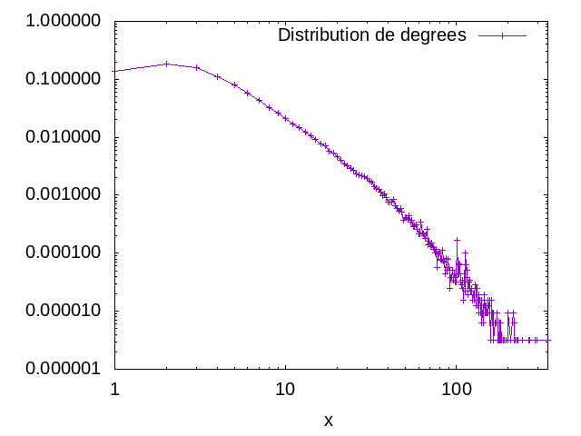
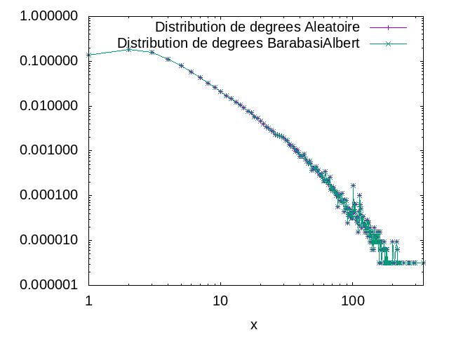
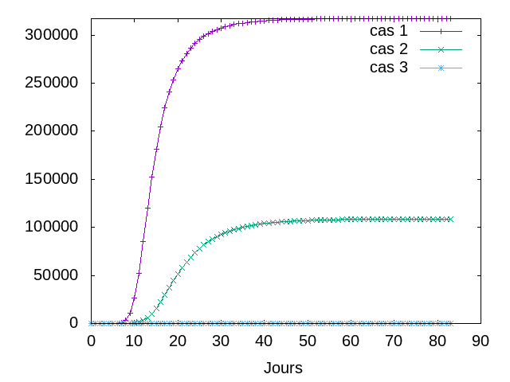

# Mesures de réseaux d'interaction (TP)

### 1)    Visualisation du [réseau de colaboration (DBLP)](https://snap.stanford.edu/data/bigdata/communities/com-dblp.ungraph.txt.gz)


### 2)  quelques mesures de base

	Nombre de nœuds  = 317080.
	
	Nombre de liens = 1049866.
	
	Le dégré moyen = 6.62208890914917.
	
	Le coefficient de clustering = 0.6324308280637396.

    Le coefficient de clustering pour un réseau aléatoire de la même taille et du même degré moyen est : 0.000021025861725732718.
 
## 3 )  

- Le reseau est connexe. (Confère La simulation et le test effectué dans mon programme)
- Un réseau aléatoire de la même taille et degré moyen ne sera pas connexe.  (Confère La simulation et le test effectué dans mon programme)

- Le réseau aléatoire avec cette taille devient connexe a partir du degré moyen  〈k〉> lnN(p>lnN/N) avec N le nombre de noeud et p la probabilité que deux voisins de v soient reliés.


## 4 )  


 #### Résultats de  la distribution des degrés :


> 1          0,13618330
     2          0,18562508
     3          0,15660717
     4          0,11079223
     5          0,08056011
     6          0,05796014
     7          0,04321938
     8          0,03272045
     9          0,02640028
    10          0,02081809
    11          0,01702409
    12          0,01470291
    13          0,01216728
    14          0,01058723
    15          0,00918380
    16          0,00778352
    17          0,00709915
    18          0,00572726
    19          0,00526681
    20          0,00468967
    21          0,00405891
    22          0,00350385
    23          0,00326416
    24          0,00292671
    25          0,00269648
    26          0,00236533
    27          0,00223918
    28          0,00214457
    29          0,00210672
    30          0,00196480
    31          0,00172827
    32          0,00168412
    33          0,00140028
    34          0,00130882
    35          0,00125520
    36          0,00112590
    37          0,00099659
    38          0,00103759
    39          0,00093036
    40          0,00075691
    41          0,00076006
    42          0,00076321
    43          0,00085152
    44          0,00065283
    45          0,00059922
    46          0,00052668
    47          0,00059922
    48          0,00051722
    49          0,00037215
    50          0,00041630
    51          0,00040999
    52          0,00038161
    53          0,00045099
    54          0,00034376
    55          0,00036899
    56          0,00029015
    57          0,00029961
    58          0,00030907
    59          0,00026176
    60          0,00021446
    61          0,00021446
    62          0,00034061
    63          0,00022707
    64          0,00021761
    65          0,00020184
    66          0,00018292
    67          0,00026176
    68          0,00014192
    69          0,00016400
    70          0,00014507
    71          0,00012930
    72          0,00015138
    73          0,00012615
    74          0,00011669
    75          0,00010092
    76          0,00011669
    77          0,00005677
    78          0,00009777
    79          0,00009777
    80          0,00010407
    81          0,00007884
    82          0,00007569
    83          0,00011354
    84          0,00007254
    85          0,00006938
    86          0,00004415
    87          0,00008200
    88          0,00005046
    89          0,00007884
    90          0,00005677
    91          0,00005046
    92          0,00002523
    93          0,00003785
    94          0,00003785
    95          0,00005046
    96          0,00003469
    97          0,00004415
    98          0,00003785
    99          0,00003154
   100          0,00003154
   101          0,00017030
   102          0,00004415
   103          0,00006623
   104          0,00004415
   105          0,00006308
   106          0,00003154
   107          0,00002838
   108          0,00002523
   109          0,00003469
   110          0,00001577
   111          0,00004415
   112          0,00002208
   113          0,00010092
   114          0,00006308
   115          0,00003785
   116          0,00005046
   117          0,00001892
   118          0,00003154
   119          0,00003469
   120          0,00002523
   121          0,00002208
   122          0,00002523
   123          0,00002208
   124          0,00001577
   125          0,00001892
   126          0,00001892
   127          0,00001577
   128          0,00001892
   129          0,00002838
   130          0,00002523
   131          0,00001262
   132          0,00002523
   133          0,00001262
   134          0,00001577
   135          0,00000946
   136          0,00001892
   137          0,00001577
   138          0,00001262
   139          0,00000946
   140          0,00001577
   141          0,00000631
   142          0,00000946
   143          0,00000631
   144          0,00000946
   145          0,00001892
   146          0,00001262
   147          0,00001262
   148          0,00000946
   149          0,00000946
   150          0,00001262
   151          0,00000946
   152          0,00000946
   153          0,00001577
   155          0,00001262
   156          0,00001577
   157          0,00000946
   158          0,00000315
   159          0,00000315
   160          0,00001577
   161          0,00000946
   162          0,00000631
   163          0,00000946
   164          0,00000946
   165          0,00000315
   168          0,00000631
   170          0,00000631
   172          0,00000946
   174          0,00000631
   175          0,00000315
   176          0,00000315
   177          0,00000315
   178          0,00000315
   179          0,00000631
   180          0,00000315
   181          0,00000315
   182          0,00000631
   183          0,00000315
   184          0,00000315
   188          0,00000315
   190          0,00000315
   191          0,00000315
   195          0,00000315
   200          0,00000315
   201          0,00000946
   207          0,00000315
   208          0,00000315
   215          0,00000946
   218          0,00000631
   219          0,00000315
   221          0,00000315
   225          0,00000315
   227          0,00000315
   230          0,00000315
   244          0,00000315
   264          0,00000315
   269          0,00000315
   290          0,00000315
   296          0,00000315
   343          0,00000315


 #### Contenu du fichier `distributionDegrees.gnuplot`  à l'echelle linéaire :


```php set terminal png 15  
set encoding utf8  
set output "distributionDegrees.png"  
set xrange [0:345]  
set yrange [0:0.189]  
set xlabel "x"  
plot "file_distributionDegrees" t "Distribution de degrees" with linesp lt 1 pt 1
```

 #### distribution des degrés tracé a l'échelle linéaire avec  `gnuplot`  :


 #### Contenu du fichier `distributionDegrees.gnuplot` à l'echelle log-log  :

```php
set terminal png 15  
set encoding utf8    
set output "distributionDegreesLogLog.png"  
set yrange [1e-6:1] 
set logscale xy  
set xlabel "x"    
plot "file_distributionDegrees" t "Distribution de degrees" with linesp lt 1 pt 1
```

 #### distribution des degrés tracé a l'échelle log-log avec  `gnuplot`  :
 

 

- Oui on observe une ligne droite en log-log. 

- En echelle log-log  les axes du graphique ont des échelles logarithmiques. On observe une droite qui  nous indique que la distribution des degrés suit une loi de puissance.


 #### Contenu du fichier `all_in_one.gnuplot`  :
 
```php 
set terminal png  
set xlabel 'k'  
set ylabel 'p(k)'  
set output "all_in_one.png"  
  
set logscale xy  
set yrange [1e-6:1]  
# POISSON  
lambda = 6.622  
poisson(x) = lambda ** x * exp(-lambda)/gamma(x+1)  
  
f(x) = lc - gamma * x  
fit f(x) 'all_in_one' using (log($1)):(log($2)) via lc, gamma  
  
 # lc    = 2.34298       +/- 0.1971      (8.414%)  
 # gamma = 2.70556       +/- 0.04438     (1.64%)  
  
c = exp(lc)  
  
power (x) = c * x ** (-gamma)  
  
plot 'all_in_one' title 'DBLP', \  
    poisson(x) title 'distribution de Poisson', \  
    power(x) title 'Coeficient de la loi de puissance'
```

 #### distribution de Poisson,  degrés  et les coefficients de la loi de puissance a l'échelle log-log  avec  `gnuplot`  :
 


## 5 )  

- La distance moyenne dans le réseau de collaboration  = 6.808506411631135  (D'apres le calcule effectué dans mon programme)
- Oui  l'hypothèse des six degrés de séparation se confirme car la distance moyenne dans le reseau atteint 6.
- Oui il s'agit d'un reseau petit monde car car tout noeud du reseau peut être reliée à n’importe quelle autre noeud du reseau.

- La distance moyenne dans un réseau aléatoire avec les mêmes caractéristiques = ln(317080)/ln( 6.62208890914917) = 6.70061181886

 #### Contenu du fichier `distributionDistance.gnuplot`  :
 
```php 
set terminal png 15  
set encoding utf8  
set output "distributionDistance.png"  
set xrange [0:20]  
set yrange [0:0.3]  
set xlabel "x"  
  
plot "file_distributionDistance" t "Distribution de distance" with linesp lt 1 pt 1
```

 #### distribution des distances avec  `gnuplot`  :
 


- Cette distribution suit une loi binomial.

## 6 )  


####                                            Nombre de noeud = 100 et  le nombre de degré  = 3.


 ####                                                   Reseau BarabasiAlbert
 
		

 ####                                                    Reseau Aleatoire


	Noeud du reseau aleatoire = 104
	Noeud du reseau BarabasiAlbert = 102

	Liens du reseau aleatoire = 168
	Liens du reseau BarabasiAlbert = 202

	degré moyen du reseau aleatoire= 3.038461446762085
	degré moyen du reseau Barabasi-Albert= 4.196078300476074

	coefficient de clustering du reseau aleatoire : 0.023931623931623937
	coefficient de clustering du reseau Barabasi-Albert : 0.12529991794697679

	Le reseau aleatoire n'est pas connexe
	Le reseau BarabasiAlbert est connexe

	 la distance moyenne dans le reseau aleatoire = ln(100)/ln3 = 4.19180654858
	la distance moyenne dans le reseau de Barabasi-Albert  = ln(100)/ln(ln(100))  = 3.01547382388
	
	
	
 ####           Distribution de degré : 
 



 ####           Distribution de distance : 
 


	
 ### Comparaison avec le réseau de collaboration en utilisant les donnees du reseau de collaboration:
 

```
la distance moyenne dans le reseau aleatoire = 6.70061181886
la distance moyenne dans DBLP  = 6.817238797779739
la distance moyenne dans le reseau Barabasi-Albert = ln(317080)/ln(ln(317080)) = 4.9889500374

Le coefficient de clustering du reseau Barabasi-Albert : 0.00041089895384694076
Le coefficient de clustering dans DBLP = 0.6324308280637396.
Le coefficient de clustering dans le  réseau aléatoire : 0.000021025861725732718.
 

 ```
 - Les résultats expérimentaux ne  correspondent pas  aux prédictions théoriques .
 
  #### Conclusion
  
  Comparaison avec le réseau de collaboration:
 
Dans le reseau Barabasi-Albert , une arête a plus de probabilité de se lier à des sommets qui ont un plus haut degré qu'eux enfin de devenir connexe et la distance moyenne dans ce reseau est faible comparer au reseau de colaboration et aleatoire.
Le reseau Barabasi-Albert et le reseau de colaboration sont tous deux connexe contrairement au resau aléatoire.
Le réseau aléatoire  a une faible coefficient de clusterisation comparé aux autres reseau.

## 7 )  Question bonus


### J'ai utiliser un generateur de WattsStrogatzGenerator pour pouvoir resoudre cette question.


```java


import org.graphstream.algorithm.generator.Generator;
import org.graphstream.algorithm.generator.WattsStrogatzGenerator;
import org.graphstream.graph.Graph;
import org.graphstream.graph.implementations.SingleGraph;


public class MonGraphe {

    public Graph question7(int node, int degre, double proba) { //new MonGraphe().question7(100, 4, 0.9);


        Graph graph = new SingleGraph("graph");

        // n est le nombre de sommet, 4 le nombre de degree moyen et beta la probabilité

        Generator gen = new WattsStrogatzGenerator(node,degre,proba);

        gen.addSink(graph);
        gen.begin();
        while (gen.nextEvents()) {
        }
        gen.end();

        graph.display(false);
        return graph;
    }
}

```

 
 
 - Le generateur WattsStrogatzGenerator arrive a nous reproduire un coefficient de clustering netement petite et en plus le reseau reste connexe. Ce generateur semble etre une amelioration du generateur du reseau de BarabasiAlbert.
 - Plus la probabilté augmente, plus le nombre d'arret augmente.


# Suite du TP : Propagation dans des réseaux .


### 1 )  
 -  Le taux de propagation du virus (beta/mu) = 2.
 - Le seuil épidémique du réseau de collaboration = 0.04598472436222584
 - Le seuil épidémique du réseau aléatoire = 0.13122523453710644
 
 - Le seuil épidémique du réseau aléatoire est supérieur au seuil épidémique du réseau de collaboration .
 
  ### 2 )  
   ### Simulation de  la propagation du virus jour par jour pendant trois mois avec les scénarios suivants:
 - cas 1  : Quand on ne fait rien pour empêcher l'épidémie : 
 - cas 2 :  Quand on réussit à convaincre 50 % des individus de mettre à jour en permanence leur anti-virus (immunisation aléatoire)
  - cas 3 :  Quand on réussit à convaincre 50 % des individus de convaincre un de leurs contac ts de mettre à jour en permanence son anti-virus (immunisation sélective).

    ***Tracage de l'évolution de la fraction d'infectés de la population _non immunisée_ :***
    
 

	L'immunisation aléatoire permet de retardé l'épidemie mais pas de facon efficace.
	Mais dans le cas de l'immunisation sélective, Le virus est détruit.

  ### 3 )  
   ###  Calcul du degré moyen des groupes 0 et 1 pour  l'immunisation sélective : 

- degré moyen du groupe 0 = 6.623937176737732.
- degré moyen du groupe 1 = 18.467238551785037.

      Le degré moyen du groupe 0 est inférieur au  degré moyen du groupe 1.
      Cela veux dire que dans le groupe 1, un nœud a une forte probabilité de se connecté a d'autre nœud que dansle groupe 0.

 ### 4 )  


 #### Du point de vue du virus l'immunisation d'un nœud est équivalente à sa suppression du réseau :
  
 - Le seuil épidémique du réseau avec stratégies d'immunisation aléatoire = 0.08777135655129145.
  - Le seuil épidémique du réseau avec stratégies d'immunisation sélective = 0.17171469023657415.

**Comparaison :**

 - Le seuil épidémique du réseau initial = 0.04598472436222584

Le seuil du graphe d’immunisation  sélective est  supérieur au seuil épidémique du réseau initial et au seuil épidémique du réseau avec stratégies d'immunisation aléatoire.

 ### 4 ) 
 
Simulation de l'épidémie avec les mêmes hypothèses et les mêmes scénarios dans un réseau aléatoire et un réseau généré avec la méthode d'attachement préférentiel de la même taille et le même degré moyen. 

### méthode aléatoire :

 - cas 1  : Quand on ne fait rien pour empêcher l'épidémie : 
 - cas 2 :  Quand on réussit à convaincre 50 % des individus de mettre à jour en permanence leur anti-virus (immunisation aléatoire)
  - cas 3 :  Quand on réussit à convaincre 50 % des individus de convaincre un de leurs contac ts de mettre à jour en permanence son anti-virus (immunisation sélective).


  ***Tracage de l'évolution de la fraction d'infectés de la population _non immunisée_ :***
    
 
 Le seuil épidémique du réseau avec stratégies d'immunisation aleatoire = 0.22404182061653927
 Le seuil épidémique du réseau avec stratégies d'immunisation seclective = 0.13122491914246057

### méthode d'attachement préférentiel :

 - cas 1  : Quand on ne fait rien pour empêcher l'épidémie : 
 - cas 2 :  Quand on réussit à convaincre 50 % des individus de mettre à jour en permanence leur anti-virus (immunisation aléatoire)
  - cas 3 :  Quand on réussit à convaincre 50 % des individus de convaincre un de leurs contac ts de mettre à jour en permanence son anti-virus (immunisation sélective).

  ***Tracage de l'évolution de la fraction d'infectés de la population _non immunisée_ :***
    
 
 
 - Le seuil épidémique du réseau avec stratégies d'immunisation aleatoire = 0.053841760864521616.
 - Le seuil épidémique du réseau avec stratégies d'immunisation seclective = 0.24926274815850155.


## 
### KOUTO Dosseh
### M1 IWOCS
### [dosseh.kouto@etu.univ-lehavre.fr](https://ent.normandie-univ.fr/uPortal/f/u19824l1s547/p/messagerie-lehavre.u19824l1n897/max/render.uP?pCp)
## 
